## org.prismus.scrambler.Value
Value interface defines data generation capabilities. 

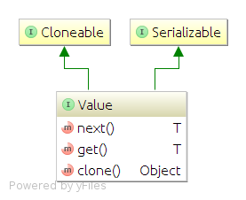

```java
/**
 * An interface used to generate data.
 */
public interface Value<T> extends Serializable, Cloneable {
    /**
     * Generates value.
     *
     * @return an instance of object
     */
    T next();

    /**
     * Gets current generated value
     *
     * @return current value
     */
    T get();
}
```

It consists of 2 methods: 

1. ``T next()``
  Generates a value. Each call will produce a new one.
2. ``T get()``
  Method is used to get the value from prior execution of ``next()`` method.
  
## Custom org.prismus.scrambler.Value implementation 
It is recommended to create custom Value implementations by extending **org.prismus.scrambler.value.Constant** class.
This class is a template that allows to get and performs value setting for newly generated object.
Your implementation has to extend method **org.prismus.scrambler.value.Constant#doNext()** for value generation.

```java
public class Constant<T> implements Value<T> {
...
    public T get() {
        return value;
    }

    public T next() {
        final T value = doNext();
        setValue(value);
        return value;
    }

    protected T doNext() {
        return value;
    }
...
}
```

**Example**

```java 
public class RandomUuid extends Constant<String> {
    @Override
    protected String doNext() {
        return UUID.randomUUID().toString();
    }
}
```

## Facades
In order to hide complexity and have a simple API, generation capabilities are exposed thru Facade classes. 
Facades are defined in ``org.prismus.scrambler`` package and are grouped per type and named accordingly.

## java.lang.Number generation facade and classes
DataScrambler offers following ways to generate a Number value:

1. Incremental Number with a step (default is 1)
1. Random simple or in a range
1. Array of objects or primitives either incrementally or randomly

**Examples:**

```java
// generate incremental integer with default step (1)
System.out.println(NumberScrambler.increment(1).next());

// generate incremental array with step (100) starting from 0
Value<Integer[]> integerArray = ArrayScrambler.incrementArray(new Integer[10], 100, 10);
System.out.println(Arrays.asList(integerArray.next()));

// generate incremental array with step (10.5) starting from 0
Value<float[]> primitiveFloatArray = ArrayScrambler.incrementArray(new float[10], 10.5f, 10);
System.out.println(Arrays.asList(primitiveFloatArray.next()));

// generate random long in a range
System.out.println(NumberScrambler.random(900L, 1000L).next());
```
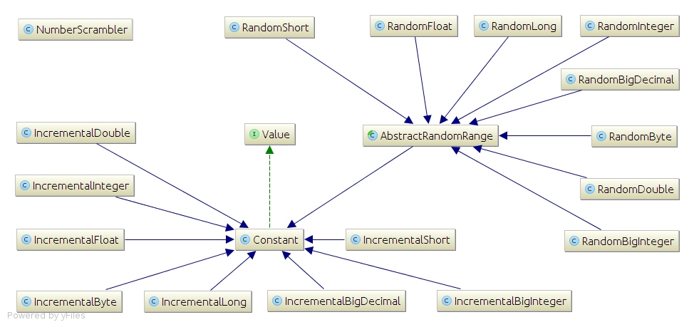

## java.util.Date generation facade and classes
Dates generation can be done in following way:
1. Incrementally by calendar step(s)
   * Steps can be defined either using ``java.util.Calendar`` constants or using builder methods (verbose instead of magic constants)
1. Randomly simple or in a range
1. Array of dates either incrementally or random

**Examples:**

```java
// generate incremented date with default step and default calendar field (DAY)
System.out.println(DateScrambler.increment(new Date()).next());

// generate incremented date by several calendar fields
System.out.println(DateScrambler.increment(new Date())
    .days(-1)
    .hours(2)
    .minutes(15)
.next());

// generate an array of dates
System.out.println(Arrays.asList(DateScrambler.arrayOf(DateScrambler.increment(new Date())
    .days(-1)
    .hours(2)
    .minutes(15),
5).next()));

// generate random date in a day period
System.out.println(DateScrambler.random(new Date()).next());
// generate random date in a month period
System.out.println(DateScrambler.random(new Date(),
        DateScrambler.increment(new Date(), -1, Calendar.MONTH).next(),
        DateScrambler.increment(new Date(), 1, Calendar.MONTH).next()
).next());

System.out.println(Arrays.asList(DateScrambler.randomArray(new Date(),
        DateScrambler.increment(new Date(), -1, Calendar.MONTH).next(),
        DateScrambler.increment(new Date(), 1, Calendar.MONTH).next(),
        5).next()));
```

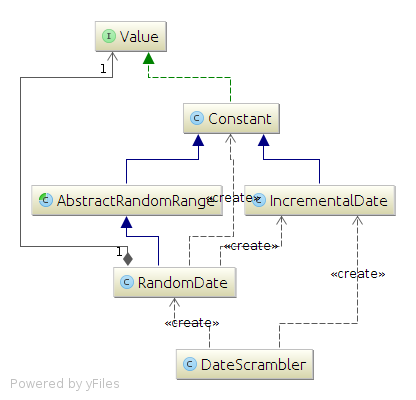

## java.lang.String generation facade and classes
1. Incremental String using provided formatter pattern with an incremented index 
1. Random String using provided pattern of specified length 
1. Random UUID String 
1. Array of Strings generated incrementally or randomly

**Examples**

```java
// Generate an incremental string based on provided String, pattern and index
System.out.println(StringScrambler.increment("test", "%s Nr%d", 100).next());

// Generate an incremental string array based on provided String, pattern and index
System.out.println(Arrays.asList(StringScrambler.incrementArray("test", "%s Nr%d", 100, 10).next()));

// Generate an random string based on template String, count length
System.out.println(StringScrambler.random("My Random String 123").next());

// Generate an random string array based on template String, count length
System.out.println(Arrays.asList(StringScrambler.randomArray("My Random String 123", 10).next()));
```

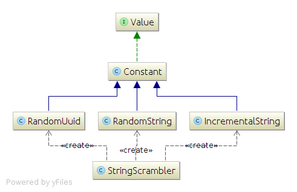

## Generic object facade and classes
1. Constant value, each call to ``next()`` returns same value
1. Generated random value (simple or in a range) by providing Class type (if supported)
1. Random array of specified class type
1. Random Boolean

**Examples**

```java
// declare a value instance that represents constant value
Assert.assertEquals(1, ObjectScrambler.constant(1).next().longValue());

// declare a value instance that will return randomly generated array
final Value<Long[]> longValues = ArrayScrambler.randomArray(1L, 10);
Assert.assertEquals(10, longValues.next().length);

// declare a value instance that will generate an array of short primitives randomly in a specified range
final Value<short[]> primitivesInRange = ArrayScrambler.arrayOf(new short[10], NumberScrambler.random((short) 900, (short) 1000));
Assert.assertEquals(10, primitivesInRange.next().length);
```

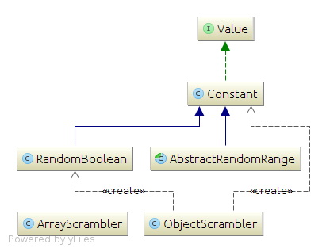

## Arrays generation facade and classes
1. Array of specified type using provided generation strategy
1. Incremental array with a step
1. Random simple or in a range
1. Random element from provided array
1. Generate an combinations array using provided array template

**Examples:**

```java
// declare a value instance that will return randomly generated primitives array
final Value<long[]> longPrimitives = ArrayScrambler.randomArray(new long[10]);
Assert.assertEquals(10, longPrimitives.next().length);

// declare a value instance that will generate an array of Long objects randomly in a specified range
final Value<Long[]> randomsInRange = ArrayScrambler.arrayOf(new Long[10], NumberScrambler.random(900L, 1000L));
Assert.assertEquals(10, randomsInRange.next().length);

// declare a value instance that will generate an array of short primitives randomly in a specified range
final Value<short[]> primitivesInRange = ArrayScrambler.arrayOf(new short[10], NumberScrambler.random((short) 900, (short) 1000));
Assert.assertEquals(10, primitivesInRange.next().length);

// Generate one combinations sequence of provided integer array using Johnson Trotter algorithm
ArrayScrambler.combinationsOf(1, 2, 3, 4, 5).next();
```

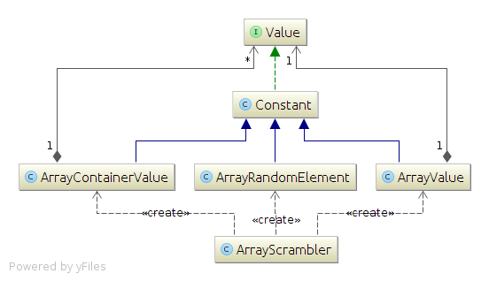

## java.util.Collection generation facade and classes
1. Generate a collection using provided strategy
1. Incremental collection
1. Random collection simple or in a range
1. Random element from provided collection template
1. Combinations using provided collection template

**Examples:**
```java
// A list of incremented integer with step 1
System.out.println(CollectionScrambler.of(new ArrayList<Integer>(), NumberScrambler.increment(1)).next());
// A list of random double in a range 1.0-400.0
System.out.println(CollectionScrambler.of(new ArrayList<Double>(), NumberScrambler.random(1.0d, 400.0d)).next());

// A random element from provided collection
System.out.printf("%s random element: %s%n", new HashSet<String>(Arrays.asList("aa", "bb", "cc")), CollectionScrambler.randomOf(new HashSet<String>(Arrays.asList("aa", "bb", "cc"))).next());
// A random element from provided collection
System.out.printf("%s random element: %s%n", new HashSet<Integer>(Arrays.asList(1, 2, 3, 4, 5)), CollectionScrambler.randomOf(Arrays.asList(1, 2, 3, 4, 5)).next());
```

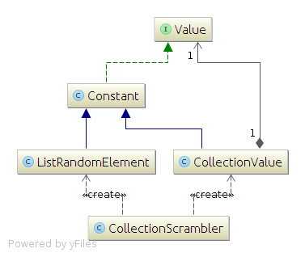

## java.util.Map generation facade and classes
1. Generate a map of values using provided key/rule

**Examples**
```java
System.out.println(MapScrambler.mapOf(LinkedHashMap.class, new LinkedHashMap() {{
    put("ValueSID", NumberScrambler.increment(1));
    put("SomeID", new Constant(1));
    put("Amount", NumberScrambler.increment(100.0d));
    put("products", CollectionScrambler.collectionOf(ArrayList.class, MapScrambler.mapOf(LinkedHashMap.class, new LinkedHashMap() {{
        put("ProductSID", NumberScrambler.increment(1));
        put("Name", new ListRandomElement<String>(Arrays.asList("Table Tennis Set", "Ping Pong Balls", "Table Tennis Racket")));
        put("Price", NumberScrambler.random(16.0d, 200.0d));
    }})));
}}).next());
```

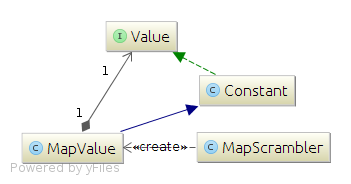

## org.prismus.scrambler.ValuePredicate interface
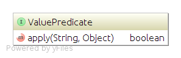
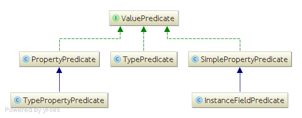
**TBD**

## Java instances facade and classes
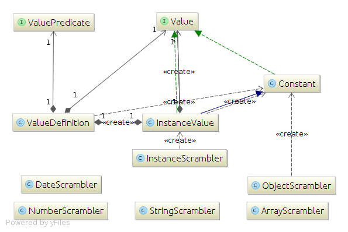

### Instance type definition' detection convention

### Default definitions

### Reference Value
**TBD**

## DataScrambler DSL

### Overview
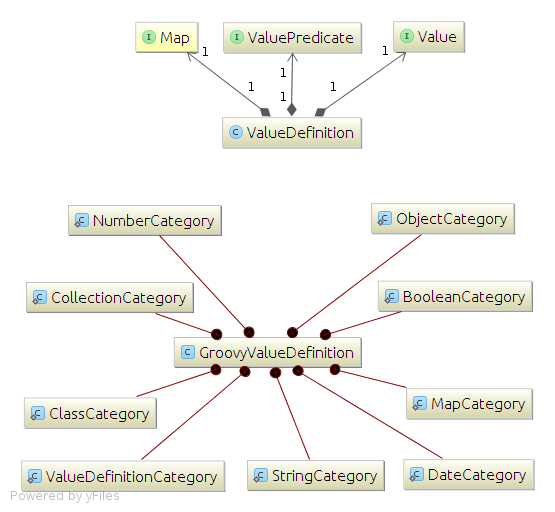

### Groovy compiler properties

## Data Scrambler extension

### Testing extension

### Definitions dictionary extensions

## Best Practices
**TBD**
