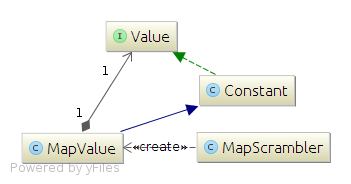

```java

System.out.println(MapScrambler.mapOf(LinkedHashMap.class, new LinkedHashMap() {{
    put("ValueSID", NumberScrambler.increment(1));
    put("SomeID", new Constant(1));
    put("Amount", NumberScrambler.increment(100.0d));
    put("products", CollectionScrambler.collectionOf(ArrayList.class, MapScrambler.mapOf(LinkedHashMap.class, new LinkedHashMap() {{
        put("ProductSID", NumberScrambler.increment(1));
        put("Name", new ListRandomElement<String>(Arrays.asList("Table Tennis Set", "Ping Pong Balls", "Table Tennis Racket")));
        put("Price", NumberScrambler.random(16.0d, 200.0d));
    }})));
}}).next());

```


